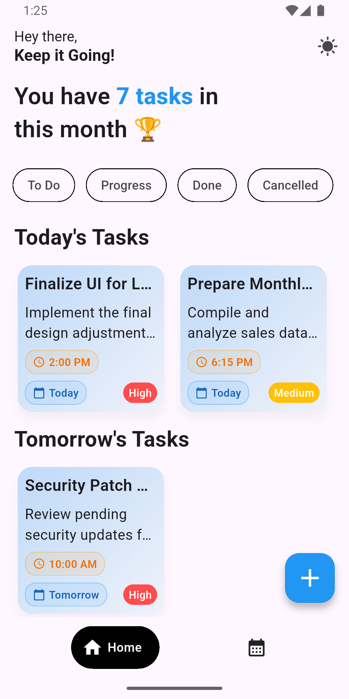
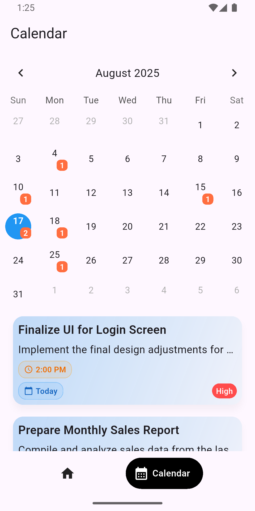
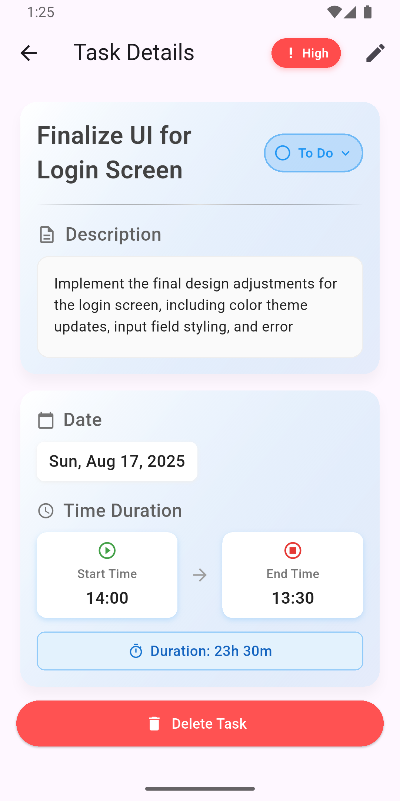
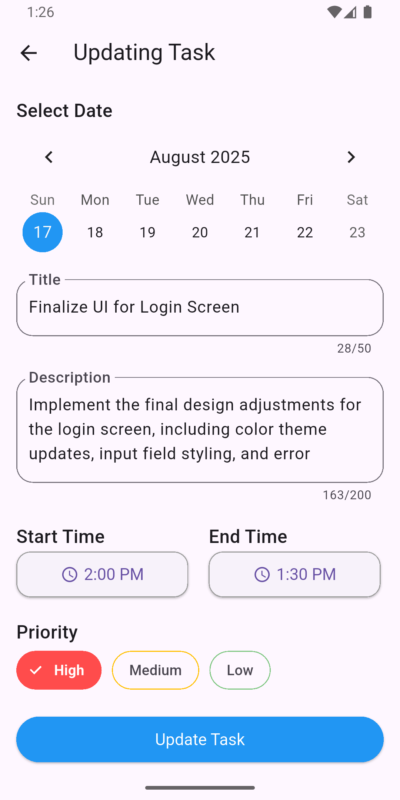

# TaskZen

## 📱 Screenshots

<!-- Add screenshots of your app here -->
| Home Screen | Calendar Screen | Task Details Screen | New Task Screen | Update Task Screen|
|-------------|-----------------|---------------------|-----------------|-------------------|
 |  |  |  | 

## ✨ Features

- **Feature 1**: Description of the main feature
- **Feature 2**: Another important feature
- **Feature 3**: Additional functionality
- **Cross-platform**: Works on both iOS and Android
- **Responsive Design**: Adapts to different screen sizes
- **Offline Support**: Works without internet connection (if applicable)

## 🚀 Getting Started

### Prerequisites

Before running this project, make sure you have the following installed:

- [Flutter](https://flutter.dev/docs/get-started/install) (version 3.0.0 or higher)
- [Dart](https://dart.dev/get-dart) (version 3.0.0 or higher)
- [Android Studio](https://developer.android.com/studio) or [VS Code](https://code.visualstudio.com/)
- [Xcode](https://developer.apple.com/xcode/) (for iOS development, macOS only)

### Installation

1. **Clone the repository**
   ```bash
   git clone https://github.com/yourusername/your-app-name.git
   cd your-app-name
   ```

2. **Install dependencies**
   ```bash
   flutter pub get
   ```

3. **Run the app**
   ```bash
   flutter run
   ```

### Platform-specific Setup

#### Android
- Minimum SDK version: 21
- Target SDK version: 34
- Make sure you have an Android device connected or an emulator running

#### iOS
- Minimum iOS version: 11.0
- Xcode 12.0 or higher
- Valid Apple Developer account (for device testing)

## 🏗️ Project Structure

```
lib/
├── main.dart                 # App entry point
├── models/                   # Data models
├── screens/                  # UI screens
├── widgets/                  # Reusable widgets
├── services/                 # API and business logic
├── utils/                    # Helper functions and constants
└── providers/                # State management (if using Provider)
```

## 📦 Dependencies

### Main Dependencies
- `flutter/material.dart` - Material Design components
- `http` - HTTP requests
- `shared_preferences` - Local storage
- `provider` - State management
- `flutter_bloc` - State management (alternative)

### Dev Dependencies
- `flutter_test` - Testing framework
- `flutter_lints` - Linting rules
- `mockito` - Mocking for tests

## 🧪 Testing

Run the test suite:

```bash
# Run all tests
flutter test

# Run tests with coverage
flutter test --coverage

# Run integration tests
flutter drive --target=test_driver/app.dart
```

## 🔧 Configuration

### Environment Variables

Create a `.env` file in the root directory:

```env
API_BASE_URL=https://your-api-url.com
API_KEY=your-api-key
```

### Firebase Setup (if applicable)

1. Add your `google-services.json` (Android) to `android/app/`
2. Add your `GoogleService-Info.plist` (iOS) to `ios/Runner/`
3. Initialize Firebase in `main.dart`

## 🚀 Building for Production

### Android (APK)
```bash
flutter build apk --release
```

### Android (App Bundle)
```bash
flutter build appbundle --release
```

### iOS
```bash
flutter build ios --release
```

## 🤝 Contributing

1. Fork the project
2. Create your feature branch (`git checkout -b feature/AmazingFeature`)
3. Commit your changes (`git commit -m 'Add some AmazingFeature'`)
4. Push to the branch (`git push origin feature/AmazingFeature`)
5. Open a Pull Request

### Code Style

This project follows the [Dart Style Guide](https://dart.dev/guides/language/effective-dart/style). Make sure to:

- Run `dart format .` before committing
- Follow the linting rules defined in `analysis_options.yaml`
- Write meaningful commit messages

## 📄 License

This project is licensed under the MIT License - see the [LICENSE](LICENSE) file for details.

## 👥 Authors

- **Your Name** - *Initial work* - [YourGitHub](https://github.com/yourusername)

## 🙏 Acknowledgments

- Flutter team for the amazing framework
- [Package Name] for [specific functionality]
- Community contributors and testers

## 📞 Support

If you have any questions or need help, please:

1. Check the [Issues](https://github.com/yourusername/your-app-name/issues) page
2. Create a new issue if your problem isn't already reported
3. Contact us at: your-email@example.com

## 🔄 Changelog

### Version 1.0.0
- Initial release
- Basic functionality implemented
- Cross-platform support

---

**Happy coding! 🎉**
